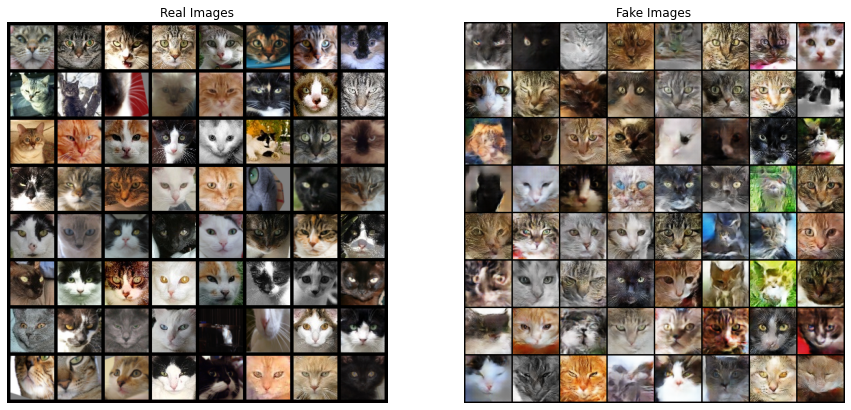
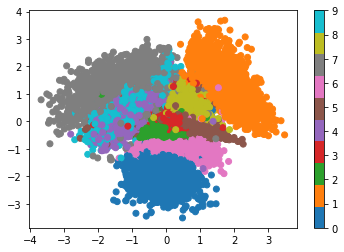
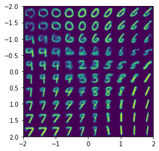

# notebooks
A collection of Jupyter notebooks for various ML tasks

### CatDCGAN
A DCGAN for creating new cat faces, trained on this dataset: https://github.com/Ferlix/Cat-faces-dataset

### VAE_MNIST
A variational auto-encoder trained on the MNIST dataset. Notebook includes visualization of the latent space, interpolation between numbers and generation of new numbers.

